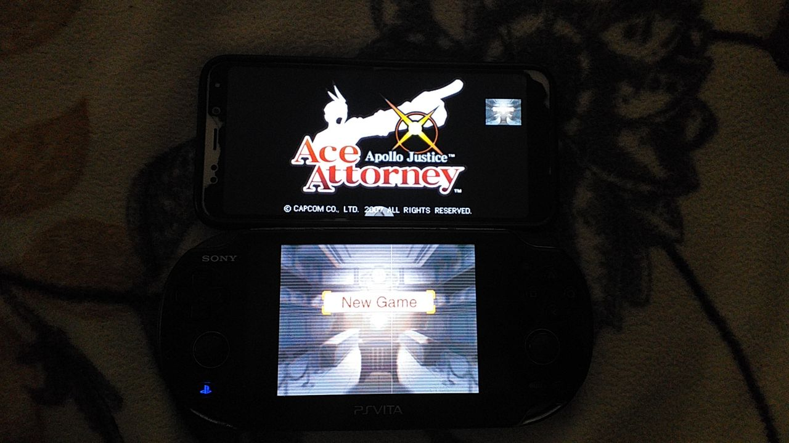

# AndroVita-DS

AndroVita-DS - it's a software that can stream second screen of emulated DS to PSVita, allowing player to use touchscreen. It uses VitaPad and VitaMote at the base to also support buttons control.

## Concept only
Don't take it seriously right now, it's just an idea, and I don't know when I'm gonna realize it.
